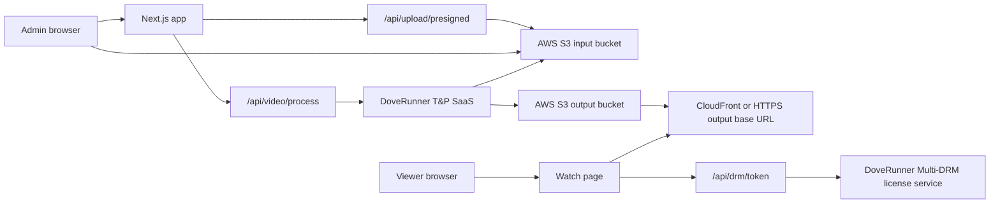

# DoveRunner T&P And AWS S3 Live Setup

This runbook creates the live upload, transcode/package, DRM, and playback path for this repo after moving away from Axinom.

Do not paste real keys into docs, tickets, chat, screenshots, or test output. Put real values only in `.env.local`, Vercel encrypted environment variables, or the target secret manager.

Do not paste license tokens, certificate contents, DoveRunner access keys, storage keys, or DRM content keys into evidence.

## Official References

- DoveRunner T&P service guide: https://docs.doverunner.com/content-security/tnp/tnp-service-guide/
- DoveRunner T&P API guide: https://docs.doverunner.com/content-security/tnp/tnp-api-guide/
- DoveRunner license token guide: https://docs.doverunner.com/content-security/multi-drm/license/license-token/
- DoveRunner HTML5 player integration: https://docs.doverunner.com/content-security/multi-drm/clients/html5-player/
- AWS S3 bucket setup: https://docs.aws.amazon.com/AmazonS3/latest/userguide/creating-bucket.html
- AWS S3 presigned uploads: https://docs.aws.amazon.com/AmazonS3/latest/userguide/PresignedUrlUploadObject.html
- AWS S3 CORS: https://docs.aws.amazon.com/AmazonS3/latest/userguide/cors.html
- AWS IAM access keys: https://docs.aws.amazon.com/IAM/latest/UserGuide/id_credentials_access-keys.html
- AWS CloudFront Origin Access Control: https://docs.aws.amazon.com/AmazonCloudFront/latest/DeveloperGuide/private-content-restricting-access-to-s3.html

## Target Architecture



The app uploads source files to an AWS S3 input bucket by presigned PUT URL. DoveRunner T&P reads that source object, transcodes it, encrypts/packages it for DASH/HLS, and writes output to the AWS S3 output bucket. Playback loads the output manifest and sends a server-generated DoveRunner license token in the `pallycon-customdata-v2` license header.

## Values To Decide First

Choose these before creating accounts or keys:

| Decision | Recommended value | Notes |
| --- | --- | --- |
| AWS account | Production-owned AWS account | Do not use personal AWS accounts. |
| AWS region | Same or nearest region to DoveRunner T&P region | DoveRunner docs currently list Oregon, Seoul, and Singapore for T&P region selection. Use the nearest supported region, or ask DoveRunner support if another region is required. |
| Input bucket | `<project>-doverunner-input-<env>` | Private bucket. Browser uploads source media here. |
| Output bucket | `<project>-doverunner-output-<env>` | Private bucket behind CloudFront OAC is preferred. |
| Output base URL | `https://<cloudfront-domain-or-custom-domain>` | This becomes `DOVERUNNER_OUTPUT_BASE_URL`. |
| T&P job type | Transcode and apply DRM | Matches this repo's secure streaming path. |
| Manifest names | `manifest.mpd`, `master.m3u8` | Use defaults unless DoveRunner output template differs. |

## AWS Setup

### 1. Create the S3 input bucket

1. Open AWS Console.
2. Go to S3 > Buckets > Create bucket.
3. Use bucket name `<project>-doverunner-input-<env>`.
4. Select the target AWS region.
5. Keep Object Ownership as `Bucket owner enforced`.
6. Keep Block Public Access enabled.
7. Enable default encryption with SSE-S3 or SSE-KMS.
8. Create the bucket.

This bucket stores source uploads. It should not be public.

### 2. Create the S3 output bucket

1. Go to S3 > Buckets > Create bucket.
2. Use bucket name `<project>-doverunner-output-<env>`.
3. Select the same AWS region as the input bucket unless there is a specific reason not to.
4. Keep Object Ownership as `Bucket owner enforced`.
5. Keep Block Public Access enabled.
6. Enable default encryption with SSE-S3 or SSE-KMS.
7. Create the bucket.

This bucket stores packaged DASH/HLS output. Prefer private S3 plus CloudFront Origin Access Control instead of public S3.

### 3. Add browser upload CORS to the input bucket

Open the input bucket > Permissions > Cross-origin resource sharing (CORS), then add this config. Replace domains with your real local, staging, and production origins.

```json
[
  {
    "AllowedHeaders": ["content-type", "x-amz-content-sha256", "x-amz-date"],
    "AllowedMethods": ["PUT"],
    "AllowedOrigins": [
      "http://localhost:3000",
      "https://<staging-domain>",
      "https://elearning.vienphuongnam.com.vn/"
    ],
    "ExposeHeaders": ["ETag"],
    "MaxAgeSeconds": 3000
  }
]
```

Use exact origins. Do not use `"*"` for production.

### 4. Create an IAM identity for the app

Use an IAM role if the deployment platform supports AWS role federation. If Vercel/environment constraints require access keys, create a dedicated IAM user for this app and keep the keys encrypted.

Create the app IAM user:

1. Open AWS Console.
2. Go to IAM > Users.
3. Click Create user.
4. Enter user name `secure-streaming-doverunner-app-<env>`.
5. Do not grant AWS Management Console access.
6. Click Next.
7. Choose Attach policies directly only if you already created the policy below. Otherwise choose Next without permissions, create the user, then attach the inline policy afterward.
8. Click Create user.

Create and attach the app S3 policy:

1. Open the created IAM user.
2. Go to Permissions.
3. Click Add permissions.
4. Choose Create inline policy.
5. Choose JSON.
6. Paste the policy below.
7. Replace `<input-bucket>` and `<output-bucket>` with real bucket names.
8. Click Next.
9. Name the policy `secure-streaming-doverunner-app-s3-<env>`.
10. Click Create policy.

Use this least-privilege policy. Replace bucket names and upload prefix if the code changes its object key pattern.

```json
{
  "Version": "2012-10-17",
  "Statement": [
    {
      "Sid": "ReadBucketMetadataForVerification",
      "Effect": "Allow",
      "Action": ["s3:GetBucketLocation", "s3:ListBucket"],
      "Resource": [
        "arn:aws:s3:::input-doverunner",
        "arn:aws:s3:::output-doverunner"
      ]
    },
    {
      "Sid": "CreateSourceUploads",
      "Effect": "Allow",
      "Action": ["s3:PutObject"],
      "Resource": "arn:aws:s3:::input-doverunner/videos/*"
    }
  ]
}
```

The app only needs enough permission to create presigned source uploads and run setup verification. It does not need broad output-bucket write permission if DoveRunner writes output with its own registered storage credentials.

Create the app access key:

1. Open the app IAM user.
2. Go to Security credentials.
3. Under Access keys, click Create access key.
4. Select Application running outside AWS, unless your AWS account policy requires another approved option.
5. Confirm the recommendation warning only if you cannot use role-based temporary credentials.
6. Add description tag `secure-streaming app <env>`.
7. Click Create access key.
8. Copy the access key ID into `AWS_ACCESS_KEY_ID`.
9. Copy the secret access key into `AWS_SECRET_ACCESS_KEY`.
10. Store both values only in `.env.local`, Vercel encrypted environment variables, or your secret manager.
11. Delete and rotate this key if it is ever pasted into docs, chat, logs, screenshots, or git.

### 5. Create an IAM identity for DoveRunner storage access

DoveRunner T&P storage registration needs credentials that can read the input bucket and write the output bucket. Use a second dedicated IAM identity for DoveRunner, not the same identity used by the app.

Create the DoveRunner storage IAM user:

1. Open AWS Console.
2. Go to IAM > Users.
3. Click Create user.
4. Enter user name `secure-streaming-doverunner-storage-<env>`.
5. Do not grant AWS Management Console access.
6. Click Next.
7. Choose Next without permissions, create the user, then attach the inline policy below.
8. Click Create user.

Create and attach the DoveRunner storage policy:

1. Open the created DoveRunner storage IAM user.
2. Go to Permissions.
3. Click Add permissions.
4. Choose Create inline policy.
5. Choose JSON.
6. Paste the policy below.
7. Replace `<input-bucket>` and `<output-bucket>` with real bucket names.
8. Click Next.
9. Name the policy `secure-streaming-doverunner-storage-s3-<env>`.
10. Click Create policy.

Use this policy:

```json
{
  "Version": "2012-10-17",
  "Statement": [
    {
      "Sid": "ListRegisteredBuckets",
      "Effect": "Allow",
      "Action": ["s3:GetBucketLocation", "s3:ListBucket"],
      "Resource": [
        "arn:aws:s3:::<input-bucket>",
        "arn:aws:s3:::<output-bucket>"
      ]
    },
    {
      "Sid": "ReadSourceUploads",
      "Effect": "Allow",
      "Action": ["s3:GetObject"],
      "Resource": "arn:aws:s3:::<input-bucket>/videos/*"
    },
    {
      "Sid": "WritePackagedOutput",
      "Effect": "Allow",
      "Action": ["s3:PutObject", "s3:GetObject"],
      "Resource": "arn:aws:s3:::<output-bucket>/*"
    }
  ]
}
```

If DoveRunner storage validation fails, temporarily add the minimum missing S3 action shown by AWS CloudTrail or DoveRunner error output, then narrow again after validation.

Create the DoveRunner storage access key:

1. Open the DoveRunner storage IAM user.
2. Go to Security credentials.
3. Under Access keys, click Create access key.
4. Select Third-party service or Application running outside AWS, depending on the option available in your AWS console.
5. Add description tag `DoveRunner T&P storage <env>`.
6. Click Create access key.
7. Copy the access key ID and secret access key one time.
8. Use these values only in DoveRunner Console when registering T&P input/output S3 storage.
9. Do not put this DoveRunner storage key in `.env.local` or Vercel unless a verifier explicitly needs it. The app should use the app IAM key from step 4.
10. Delete and recreate this key if storage registration fails because the secret was lost. AWS does not show the secret access key again.

### 6. Create CloudFront for output playback

Use the current CloudFront standard distribution wizard for a new output CDN:

1. Open AWS Console.
2. Go to CloudFront.
3. Click Create distribution.
4. In Distribution name, enter `secure-streaming-output-<env>`.
5. Choose Single website or app.
6. Click Next.
7. On the Specify origin page, set Origin type to Amazon S3.
8. For S3 origin, click Browse S3 and select `<output-bucket>`.
9. Confirm this is the regular S3 bucket origin, not the S3 static website endpoint.
10. For Settings, choose Use recommended origin settings.
11. Confirm the recommended settings include Origin Access Control (OAC). This lets CloudFront sign requests to S3 so viewers cannot fetch output objects directly from the S3 URL.
12. Click Next.
13. On Enable security protections, choose whether to enable AWS WAF. For production, enable WAF if the AWS account has a managed WAF baseline; otherwise record why it is deferred.
14. Click Next.
15. Review the distribution.
16. Click Create distribution.
17. When CloudFront offers to update the S3 bucket policy for OAC access, allow it to update the output bucket policy.
18. Wait until the distribution status finishes deploying.
19. Copy the distribution domain name, such as `d111111abcdef8.cloudfront.net`.
20. Set `DOVERUNNER_OUTPUT_BASE_URL=https://<distribution-domain-name>` unless you configure a custom domain.

If AWS does not update the bucket policy automatically, add this policy to the output bucket manually. Replace placeholders with the real AWS account ID, CloudFront distribution ID, and output bucket name.

```json
{
  "Version": "2012-10-17",
  "Statement": [
    {
      "Sid": "AllowCloudFrontServicePrincipalReadOnly",
      "Effect": "Allow",
      "Principal": {
        "Service": "cloudfront.amazonaws.com"
      },
      "Action": "s3:GetObject",
      "Resource": "arn:aws:s3:::doverunner-output/*",
      "Condition": {
        "StringEquals": {
          "AWS:SourceArn": "arn:aws:cloudfront::678695590378:distribution/EWJMCDRV6NAR7"
        }
      }
    }
  ]
}
```

If you already created a distribution and need to attach OAC later:

1. Open CloudFront.
2. In the left navigation, choose Origin access.
3. Click Create control setting.
4. Enter a name such as `secure-streaming-output-oac-<env>`.
5. Leave Signing behavior as Sign requests (recommended).
6. Set Origin type to S3.
7. Click Create.
8. Go back to CloudFront > Distributions.
9. Open the distribution.
10. Open the Origins tab.
11. Select the S3 output bucket origin.
12. Click Edit.
13. Under Origin access, choose Origin access control settings (recommended).
14. Select the OAC you created.
15. Click Save changes.
16. Add or confirm the output bucket policy allows `cloudfront.amazonaws.com` with `AWS:SourceArn` for this distribution.

CloudFront OAC keeps the S3 output bucket private while allowing playback through CDN HTTPS URLs. AWS recommends OAC instead of legacy Origin Access Identity (OAI). Do not use the S3 website endpoint for this protected output bucket because OAC does not support S3 website endpoints.

## DoveRunner Setup

### 1. Create or activate the DoveRunner account

1. Create or sign in to the DoveRunner console.
2. Confirm the account has Content Security access.
3. Request or enable:
   - Transcoding & Packaging (T&P)
   - Multi-DRM
4. Confirm the account can create T&P jobs and issue Multi-DRM licenses.

DoveRunner T&P requires subscription to Multi-DRM or Forensic Watermarking. This repo uses Multi-DRM.

### 2. Set T&P transcoding region

1. In DoveRunner Console, open Transcoding & Packaging.
2. Go to Settings.
3. Edit the transcoding region.
4. Select the nearest supported region to the AWS S3 buckets.
5. Save.

Use the same region consistently for staging and production unless cost, compliance, or latency requires separate regions.

### 3. Register AWS S3 input storage

Official DoveRunner path: Transcoding & Packaging > Storage List > Register.

Use this path when registering the input bucket only:

1. Sign in to DoveRunner Console.
2. Open Transcoding & Packaging.
3. In the Transcoding & Packaging menu, open Storage List.
4. Click Register.
5. On the storage registration screen, select the Input checkbox.
6. Leave Output unchecked if you want to register the output bucket in a separate step.
7. Enter a clear storage name, such as `secure-streaming-input-<env>`. This is the name you later select as Input Storage Name when creating a T&P job.
8. Enter the AWS S3 input bucket name, such as `input-doverunner`.
9. Enter the AWS S3 region that contains the input bucket, such as `Seoul (ap-northeast-2)`.
10. Enter the DoveRunner storage IAM access key ID created in the AWS setup section.
11. Enter the DoveRunner storage IAM secret access key.
12. Click Register.
13. Wait for DoveRunner to validate access to the S3 bucket.
14. Confirm the new storage appears in Storage List.
15. Copy the input storage ID from the registered storage row or detail view into `DOVERUNNER_TNP_INPUT_STORAGE_ID`.

Field mapping for the DoveRunner input storage screen:

| DoveRunner field | Value to enter | Where to get it |
| --- | --- | --- |
| Storage Type | `S3` | DoveRunner screen value. |
| Region | Same region as the AWS S3 input bucket, such as `Seoul (ap-northeast-2)` | AWS Console > S3 > input bucket > Properties > AWS Region. |
| I/O type | Check Input | DoveRunner screen choice. Leave Output unchecked when registering input only. |
| Input Storage Name | Friendly label, such as `doverunner-input` | You choose this. |
| Input AWS Bucket | Exact S3 input bucket name, without `s3://` | AWS Console > S3 > Buckets. |
| Input Access Key Id | Access key ID for `secure-streaming-doverunner-storage-<env>` | AWS Console > IAM > Users > `secure-streaming-doverunner-storage-<env>` > Security credentials > Access keys. |
| Input Secret Key | Secret access key paired with the Input Access Key Id | Shown only once when you create the access key in AWS IAM. If lost, delete the key and create a new one. |
| Input Description | Short note, such as `Input bucket for staging source uploads` | You choose this. Do not include secrets. |

If DoveRunner shows `Bucket details entered are invalid, Please check.`, validate with AWS CLI before trying again:

```powershell
$env:AWS_ACCESS_KEY_ID="<input-access-key-id>"
$env:AWS_SECRET_ACCESS_KEY="<input-secret-key>"
$env:AWS_DEFAULT_REGION="ap-northeast-2"

aws sts get-caller-identity
aws s3api get-bucket-location --bucket "input-doverunner"
aws s3api list-objects-v2 --bucket "input-doverunner" --max-items 1
```

Expected result:

- `aws sts get-caller-identity` returns the `secure-streaming-doverunner-storage-<env>` IAM user ARN.
- `get-bucket-location` returns the same AWS region selected in DoveRunner.
- `list-objects-v2` succeeds, even if the bucket is empty.

Do not use the app IAM access key here unless policy and rotation ownership are intentionally shared.

### 4. Register AWS S3 output storage

Skip this section if you selected both Input and Output during step 3 and already registered the output bucket.

1. Sign in to DoveRunner Console.
2. Open Transcoding & Packaging.
3. In the Transcoding & Packaging menu, open Storage List.
4. Click Register.
5. On the storage registration screen, select the Output checkbox.
6. Leave Input unchecked because the input bucket was registered in the previous step.
7. Enter a clear storage name, such as `secure-streaming-output-<env>`. This is the name you later select as Output Storage Name when creating a T&P job.
8. Enter the AWS S3 output bucket name, such as `output-doverunner`.
9. Enter the AWS S3 region that contains the output bucket.
10. Enter the DoveRunner storage IAM access key ID created in the AWS setup section.
11. Enter the DoveRunner storage IAM secret access key.
12. Click Register.
13. Wait for DoveRunner to validate access to the S3 bucket.
14. Confirm the new storage appears in Storage List.
15. Copy the output storage ID from the registered storage row or detail view into `DOVERUNNER_TNP_OUTPUT_STORAGE_ID`.

Before clicking Register, validate output access:

```powershell
$env:AWS_ACCESS_KEY_ID="<output-access-key-id>"
$env:AWS_SECRET_ACCESS_KEY="<output-secret-key>"
$env:AWS_DEFAULT_REGION="ap-northeast-2"

aws sts get-caller-identity
aws s3api get-bucket-location --bucket "output-doverunner"
aws s3api list-objects-v2 --bucket "output-doverunner" --max-items 1
"doverunner output test" | Set-Content "$env:TEMP\doverunner-output-test.txt"
aws s3api put-object --bucket "output-doverunner" --key "doverunner-validation/output-test.txt" --body "$env:TEMP\doverunner-output-test.txt"
aws s3api head-object --bucket "output-doverunner" --key "doverunner-validation/output-test.txt"
```

If the same DoveRunner storage IAM identity covers both buckets, the DoveRunner console may allow using the same credentials for input and output.

### 5. Collect T&P API credentials

The DoveRunner T&P API guide says the token API uses Basic auth with `EmailID:AccessKey`, then calls `https://tnp.doverunner.com/api/token/{siteId}`. In this repo, `DOVERUNNER_TNP_ACCOUNT_ID` means DoveRunner `EmailID`; it is not an AWS account ID.

| App env var | DoveRunner source |
| --- | --- |
| `DOVERUNNER_TNP_ACCOUNT_ID` | DoveRunner service account email. Official docs call this `EmailID`. Start with the email you use to sign in to DoveRunner Console. If your tenant has a separate API service account, use that email instead. |
| `DOVERUNNER_TNP_ACCESS_KEY` | DoveRunner service account `AccessKey`. Official docs call this `AccessKey`. It may be shown in DoveRunner Console Site Settings, account/API settings, or provided/reset by DoveRunner support. |
| `DOVERUNNER_TNP_API_BASE_URL` | `https://tnp.doverunner.com` unless DoveRunner support gives you a tenant-specific base URL. |

Detailed collection steps:

1. Sign in to DoveRunner Console with the account that owns the T&P service.
2. Confirm the same account can open Transcoding & Packaging and see Storage List or Job List.
3. Copy the account email into `DOVERUNNER_TNP_ACCOUNT_ID`.
4. Open site, service, account, or API settings and look for `AccessKey`, `Access Key`, or API access key.
5. Copy that DoveRunner access key into `DOVERUNNER_TNP_ACCESS_KEY`.
6. Set `DOVERUNNER_TNP_API_BASE_URL=https://tnp.doverunner.com`.
7. Keep the value server-only. Do not expose it as `NEXT_PUBLIC_*`.

If the console does not show a T&P `AccessKey`, send DoveRunner support this request:

```text
Please provide or reset the T&P API EmailID and AccessKey for Site ID <site-id>.
We need the values used for Basic auth to call https://tnp.doverunner.com/api/token/{siteId}.
```

Verification without printing secrets:

```powershell
$basic = [Convert]::ToBase64String([Text.Encoding]::UTF8.GetBytes("$env:DOVERUNNER_TNP_ACCOUNT_ID`:$env:DOVERUNNER_TNP_ACCESS_KEY"))
Invoke-RestMethod -Method Get `
  -Uri "https://tnp.doverunner.com/api/token/$env:DOVERUNNER_SITE_ID" `
  -Headers @{ Authorization = "Basic $basic" }
```

Expected response has `error_code` equal to `0000` and `data.token` containing a bearer token. Do not paste the token into chat or docs.

### 6. Collect Multi-DRM license credentials

These values are used by the app to generate short-lived license tokens after entitlement checks. The browser receives only the generated token and sends it to DoveRunner in `pallycon-customdata-v2` during the license request.

| App env var | DoveRunner source |
| --- | --- |
| `DOVERUNNER_SITE_ID` | DoveRunner Console Site ID. The T&P docs describe this as a four-character alphanumeric Site ID shown on Console. |
| `DOVERUNNER_ACCESS_KEY` | Multi-DRM Site Settings Access Key used by server-side license token generation. |
| `DOVERUNNER_LICENSE_URL` | DoveRunner license acquisition URL. Use `https://drm-license.doverunner.com/ri/licenseManager.do` unless DoveRunner gives a tenant-specific URL. |
| `DOVERUNNER_FAIRPLAY_CERT_URL` | Optional FairPlay certificate URL for Safari/FairPlay. Usually `https://drm-license.doverunner.com/ri/fpsKeyManager.do?siteId=<SITE_ID>` for base64 cert data, or `https://drm-license.doverunner.com/ri/fpsCert.do?siteId=<SITE_ID>` for `.der` cert download, depending on player support. |

Detailed collection steps:

1. Sign in to DoveRunner Console.
2. Open Content Security or Multi-DRM.
3. Open the site used for this project.
4. Open Site Settings.
5. Copy Site ID into `DOVERUNNER_SITE_ID`.
6. Copy Access Key into `DOVERUNNER_ACCESS_KEY`.
7. Set `DOVERUNNER_LICENSE_URL=https://drm-license.doverunner.com/ri/licenseManager.do`.
8. If Safari/FairPlay is in scope, confirm FairPlay is provisioned for the site.
9. Set `DOVERUNNER_FAIRPLAY_CERT_URL` to the FairPlay certificate URL that matches the player integration.
10. Keep `DOVERUNNER_ACCESS_KEY` server-only. Do not expose it as `NEXT_PUBLIC_*`.

Do not confuse these keys:

| Key | Used by | Stored where |
| --- | --- | --- |
| AWS app access key | App presigns source uploads | `AWS_ACCESS_KEY_ID`, `AWS_SECRET_ACCESS_KEY` |
| AWS DoveRunner storage key | DoveRunner reads/writes S3 buckets | DoveRunner Storage Register screen only |
| DoveRunner T&P `EmailID:AccessKey` | App obtains T&P API bearer token | `DOVERUNNER_TNP_ACCOUNT_ID`, `DOVERUNNER_TNP_ACCESS_KEY` |
| DoveRunner Multi-DRM Site ID/Access Key | App generates playback license token | `DOVERUNNER_SITE_ID`, `DOVERUNNER_ACCESS_KEY` |

## App Environment Variables

Set these in `.env.local` for local testing and in Vercel Environment Variables for preview/staging/production.

```bash
DOVERUNNER_SITE_ID=<SITE_ID>
DOVERUNNER_ACCESS_KEY=<SITE_ACCESS_KEY>
DOVERUNNER_LICENSE_URL=https://drm-license.doverunner.com/ri/licenseManager.do
DOVERUNNER_TNP_ACCOUNT_ID=<TNP_ACCOUNT_ID>
DOVERUNNER_TNP_ACCESS_KEY=<TNP_ACCESS_KEY>
DOVERUNNER_TNP_INPUT_STORAGE_ID=<INPUT_STORAGE_ID>
DOVERUNNER_TNP_OUTPUT_STORAGE_ID=<OUTPUT_STORAGE_ID>
DOVERUNNER_TNP_API_BASE_URL=https://tnp.doverunner.com
DOVERUNNER_OUTPUT_BASE_URL=https://<cloudfront-or-output-domain>
DOVERUNNER_DASH_MANIFEST_NAME=manifest.mpd
DOVERUNNER_HLS_MANIFEST_NAME=master.m3u8
DOVERUNNER_LICENSE_TOKEN_TTL_SECONDS=300
# Optional, only when FairPlay is provisioned:
DOVERUNNER_FAIRPLAY_CERT_URL=https://<fairplay-cert-url>

AWS_REGION=<AWS_REGION>
AWS_S3_INPUT_BUCKET=<INPUT_BUCKET>
AWS_S3_OUTPUT_BUCKET=<OUTPUT_BUCKET>
AWS_ACCESS_KEY_ID=<APP_AWS_ACCESS_KEY_ID>
AWS_SECRET_ACCESS_KEY=<APP_AWS_SECRET_ACCESS_KEY>
```

Required variables are validated by `src/lib/media-provider/doverunner-env.ts`. Missing values throw `Missing required DoveRunner media environment variable: <KEY>`.

## Vercel Setup

1. Open Vercel project settings.
2. Add every required `DOVERUNNER_*` and `AWS_*` value to Preview and Production as needed.
3. Keep different bucket names and DoveRunner storage IDs per environment.
4. Redeploy after adding or changing environment variables.
5. Do not expose any access key through `NEXT_PUBLIC_*`.

Recommended environment split:

| Environment | Input bucket | Output bucket | DoveRunner storages |
| --- | --- | --- | --- |
| Local | Dev input bucket | Dev output bucket | Dev storage IDs |
| Preview/Staging | Staging input bucket | Staging output bucket | Staging storage IDs |
| Production | Production input bucket | Production output bucket | Production storage IDs |

## Live Verification

### 1. Config-only validation

Run:

```bash
npm run verify:doverunner
```

Expected result:

- Required env vars are present.
- Optional defaults are displayed as status only.
- No keys, tokens, or object contents are printed.

### 2. Live provider validation

Run only after real DoveRunner and AWS credentials are configured:

```bash
npm run verify:doverunner -- --live
```

Expected result:

- DoveRunner T&P token/auth request succeeds.
- DoveRunner T&P settings or storage lookup succeeds.
- AWS input bucket is reachable.
- AWS output bucket is reachable.
- No secrets are printed.

If this command fails, fix provider setup before testing upload/playback.

### 3. Upload test

1. Sign in as admin.
2. Upload a short MP4 test file.
3. Confirm `/api/upload/presigned` returns a presigned S3 PUT URL.
4. Confirm browser PUT to S3 returns success.
5. In AWS S3, confirm the source object exists under the expected `videos/` prefix.

Do not use paid/licensed production media for first validation.

### 4. Process test

1. From admin UI, trigger video processing.
2. Confirm `/api/video/process` submits a DoveRunner T&P job.
3. Confirm the video record stores provider status and provider job ID.
4. In DoveRunner Console, confirm the job appears in T&P job history.
5. Wait until the job completes.

### 5. Sync test

1. Trigger `/api/video/sync` from the app flow or admin action.
2. Confirm provider status changes to completed/ready.
3. Confirm the app stores:
   - provider content ID
   - DASH manifest URL
   - HLS manifest URL
4. Open the stored manifest URLs through `DOVERUNNER_OUTPUT_BASE_URL` and confirm HTTP 200.

### 6. Playback test

1. Sign in as a user allowed to view the video.
2. Open the watch page.
3. Confirm the player loads the DASH or HLS manifest.
4. Confirm `/api/drm/token` returns a token response to the browser.
5. Confirm the license request to DoveRunner uses `pallycon-customdata-v2`.
6. Confirm DoveRunner license response succeeds.
7. Confirm playback advances for at least 30 seconds.

### 7. Safari/FairPlay test

Run:

```bash
npm run verify:safari-fairplay
```

Then use real macOS Safari:

1. Confirm `DOVERUNNER_FAIRPLAY_CERT_URL` is configured.
2. Open the watch page in Safari.
3. Confirm certificate request succeeds.
4. Confirm FairPlay license request succeeds.
5. Confirm playback advances.

## Troubleshooting

| Symptom | Likely cause | Fix |
| --- | --- | --- |
| `Missing required DoveRunner media environment variable` | Required env var not set in local shell or Vercel | Set the named variable and redeploy if on Vercel. |
| S3 upload blocked by browser CORS | Input bucket CORS missing origin, method, or headers | Add exact app origin, `PUT`, and required request headers to S3 CORS. |
| S3 `SignatureDoesNotMatch` | Region, bucket, key, or signed headers differ from actual PUT | Confirm `AWS_REGION`, bucket name, object key, and `Content-Type` match the presigned request. |
| S3 `AccessDenied` on upload | App IAM identity lacks `s3:PutObject` for upload prefix | Update app IAM policy for `arn:aws:s3:::<input-bucket>/videos/*`. |
| DoveRunner storage registration fails | DoveRunner IAM identity cannot list/read/write required S3 paths | Check CloudTrail and grant minimum missing S3 action for the registered buckets. |
| DoveRunner T&P auth fails | Wrong T&P account identifier or access key | Confirm exact API credential fields with DoveRunner console/support. |
| DoveRunner T&P returns `E9011` | Trial packaging job limit exceeded. DoveRunner docs list this as trial job limit `2`. | Ask DoveRunner support to reset/upgrade the T&P account, or switch the app to a paid/production T&P tenant. Retrying with the same account will keep failing. |
| Job stuck or fails quickly | Source path wrong, unsupported source format, or trial limitation | Confirm object exists in input bucket and matches DoveRunner supported formats/limits. |
| Manifest URL returns 404 | Output path/base URL mismatch or job not completed | Compare DoveRunner output directory with `DOVERUNNER_OUTPUT_BASE_URL` and manifest names. |
| Playback loads manifest but license fails | Wrong site ID/access key/content ID/token TTL | Confirm license token payload maps to DoveRunner content ID and uses current site key. |
| Widevine license request missing header | Player DRM config not applying custom header | Confirm Shaka/DoveRunner integration sends `pallycon-customdata-v2` only to license URL. |
| Safari fails only | FairPlay certificate URL missing or wrong | Configure `DOVERUNNER_FAIRPLAY_CERT_URL` and rerun Safari/FairPlay verification. |

## Acceptance Checklist

Setup is ready when all items are true:

- AWS input bucket exists, private, encrypted, and has upload CORS for allowed app origins.
- AWS output bucket exists, private, encrypted, and is readable through HTTPS output base URL.
- CloudFront OAC or equivalent secure output access is configured.
- App AWS identity can presign source uploads only for intended prefix.
- DoveRunner storage identity can read input objects and write output objects.
- DoveRunner T&P region is set.
- DoveRunner T&P input/output storage IDs are recorded in environment variables.
- DoveRunner Multi-DRM site ID and access key are configured.
- `npm run verify:doverunner` passes.
- `npm run verify:doverunner -- --live` passes.
- Admin can upload source media to S3.
- Admin can process media through DoveRunner T&P.
- Sync stores completed provider status and playable manifest URLs.
- Authorized user can play encrypted content with a successful DoveRunner license request.
- Safari/FairPlay passes if FairPlay is in release scope.

Record evidence with timestamps, environment name, job ID, manifest HTTP status, and playback result. Redact bucket object names if they identify licensed media. Never record access keys, license tokens, DRM keys, or certificate contents.
