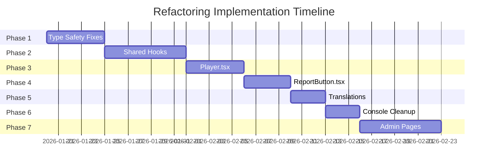

# Refactoring Implementation Plan

**Project**: Secure Video Platform  
**Created**: January 16, 2026  
**Estimated Duration**: 4-6 weeks (part-time)

---

## Executive Summary

This plan addresses 28 large files, 50+ type safety issues, and architectural improvements identified in the refactoring analysis. The approach is incremental, ensuring the application remains functional throughout.

---

## Phase 1: Type Safety & Quick Wins (Week 1)

### Goal: Improve type safety without structural changes

| Task | Files | Effort | Risk |
|------|-------|--------|------|
| 1.1 Fix `catch (error: any)` patterns | 5 files | 1 hour | Low |
| 1.2 Add Shaka Player type definitions | 1 file | 2 hours | Low |
| 1.3 Type `useState<any>` in video components | 3 files | 1 hour | Low |
| 1.4 Replace `as any` with proper types | 10 files | 3 hours | Low |
| 1.5 Create shared type definitions | New file | 2 hours | Low |

#### 1.1 Fix Catch Block Types

```typescript
// Files to update:
// - src/lib/redis.ts (5 occurrences)
// - src/lib/axinom-*.ts (3 occurrences)

// Before
} catch (error: any) {
  console.error(error.message);
}

// After
} catch (error: unknown) {
  const message = error instanceof Error ? error.message : 'Unknown error';
  console.error(message);
}
```

#### 1.2 Shaka Player Types

```typescript
// Create: src/types/shaka-player.d.ts
declare module 'shaka-player/dist/shaka-player.ui.js' {
  export default shaka;
}

declare namespace shaka {
  class Player {
    attach(video: HTMLVideoElement): Promise<void>;
    load(url: string): Promise<void>;
    configure(config: PlayerConfiguration): void;
    destroy(): Promise<void>;
    getNetworkingEngine(): NetworkingEngine | null;
  }
  // ... more types
}
```

#### 1.5 Shared Types File

```typescript
// Create: src/types/index.ts
export interface ApiResponse<T> {
  success: boolean;
  data?: T;
  error?: string;
}

export interface PaginatedResponse<T> extends ApiResponse<T[]> {
  total: number;
  page: number;
  limit: number;
}

export interface AdminTableProps<T> {
  data: T[];
  loading: boolean;
  onRefresh: () => void;
}
```

---

## Phase 2: Shared Hooks Extraction (Week 2)

### Goal: Create reusable hooks to reduce duplication

| Task | Source Files | New Files | Effort |
|------|--------------|-----------|--------|
| 2.1 Create `useAdminData` hook | 6 admin pages | 1 hook | 3 hours |
| 2.2 Create `useAdminFilters` hook | 6 admin pages | 1 hook | 2 hours |
| 2.3 Create `useTablePagination` hook | 6 admin pages | 1 hook | 2 hours |
| 2.4 Apply hooks to 1 admin page | 1 page | - | 2 hours |
| 2.5 Apply hooks to remaining pages | 5 pages | - | 4 hours |

#### 2.1 useAdminData Hook

```typescript
// Create: src/hooks/admin/useAdminData.ts
import { useState, useEffect, useCallback } from 'react';

interface UseAdminDataOptions<T> {
  endpoint: string;
  initialFilters?: Record<string, string>;
  transform?: (data: any) => T[];
}

export function useAdminData<T>({
  endpoint,
  initialFilters = {},
  transform = (d) => d,
}: UseAdminDataOptions<T>) {
  const [data, setData] = useState<T[]>([]);
  const [loading, setLoading] = useState(true);
  const [error, setError] = useState<string | null>(null);
  const [filters, setFilters] = useState(initialFilters);

  const fetchData = useCallback(async () => {
    setLoading(true);
    try {
      const params = new URLSearchParams(filters);
      const res = await fetch(`${endpoint}?${params}`);
      if (!res.ok) throw new Error('Failed to fetch');
      const json = await res.json();
      setData(transform(json));
      setError(null);
    } catch (e) {
      setError(e instanceof Error ? e.message : 'Unknown error');
    } finally {
      setLoading(false);
    }
  }, [endpoint, filters, transform]);

  useEffect(() => { fetchData(); }, [fetchData]);

  return { data, loading, error, filters, setFilters, refetch: fetchData };
}
```

#### Expected Impact

```
Before: Each admin page ~400 lines
After: Each admin page ~150 lines (62% reduction)
```

---

## Phase 3: Player.tsx Refactoring (Week 3)

### Goal: Split 460-line component into focused modules

| Task | Extract From | New File | Lines |
|------|--------------|----------|-------|
| 3.1 Extract `usePlayerInit` | Lines 47-163 | `hooks/usePlayerInit.ts` | ~120 |
| 3.2 Extract `useHeartbeat` | Lines 206-276 | `hooks/useHeartbeat.ts` | ~80 |
| 3.3 Extract `useBlackScreenDetection` | Lines 278-349 | `hooks/useBlackScreenDetection.ts` | ~75 |
| 3.4 Extract `useWakeLock` | Lines 351-379 | `hooks/useWakeLock.ts` | ~30 |
| 3.5 Extract `useIOSDetection` | Lines 174-183 | `hooks/useIOSDetection.ts` | ~15 |
| 3.6 Refactor main Player.tsx | - | - | ~100 |

#### 3.1 usePlayerInit Hook

```typescript
// Create: src/components/video/hooks/usePlayerInit.ts
import { useEffect, useRef, useState } from 'react';

interface UsePlayerInitOptions {
  manifestUrl: string;
  licenseServerUrl?: string;
  drmToken?: string;
  drmType?: 'widevine' | 'playready' | 'fairplay';
  robustness?: string;
  fairplayCertUrl?: string;
}

export function usePlayerInit(
  videoRef: React.RefObject<HTMLVideoElement>,
  containerRef: React.RefObject<HTMLDivElement>,
  options: UsePlayerInitOptions
) {
  const [player, setPlayer] = useState<shaka.Player | null>(null);
  const [error, setError] = useState<Error | null>(null);

  useEffect(() => {
    const initPlayer = async () => {
      // ... initialization logic from Player.tsx lines 47-163
    };

    initPlayer();
    return () => { player?.destroy(); };
  }, [options]);

  return { player, error };
}
```

#### 3.2 useHeartbeat Hook

```typescript
// Create: src/components/video/hooks/useHeartbeat.ts
export function useHeartbeat(
  videoRef: React.RefObject<HTMLVideoElement>,
  videoId?: string,
  intervalMs: number = 60000
) {
  const [viewCount, setViewCount] = useState(0);
  const [isNewView, setIsNewView] = useState(true);
  const intervalRef = useRef<NodeJS.Timeout | null>(null);

  // ... heartbeat logic from Player.tsx lines 206-276
  
  return { viewCount, isNewView };
}
```

#### Final Player.tsx Structure

```typescript
// src/components/video/Player.tsx (~100 lines)
export default function Player(props: PlayerProps) {
  const videoRef = useRef<HTMLVideoElement>(null);
  const containerRef = useRef<HTMLDivElement>(null);
  
  const { player, error } = usePlayerInit(videoRef, containerRef, {
    manifestUrl: props.manifestUrl,
    // ...
  });
  
  useHeartbeat(videoRef, props.videoId);
  useBlackScreenDetection(videoRef, player, props.onBlackScreenDetected);
  useWakeLock(props.isFakeFullscreen);
  const { isIOS, isFakeFullscreen, toggleFullscreen } = useIOSFullscreen();

  return (
    <div ref={containerRef}>
      <video ref={videoRef} />
      {props.watermarkText && <Watermark text={props.watermarkText} />}
      {isIOS && <FullscreenButton onClick={toggleFullscreen} />}
    </div>
  );
}
```

---

## Phase 4: ReportButton.tsx Refactoring (Week 4)

### Goal: Split 419-line component into focused modules

| Task | New File | Purpose |
|------|----------|---------|
| 4.1 Extract `useReportForm` | `hooks/useReportForm.ts` | Form state & validation |
| 4.2 Extract `useMyTickets` | `hooks/useMyTickets.ts` | Ticket fetching |
| 4.3 Extract `useReCaptcha` | `hooks/useReCaptcha.ts` | reCAPTCHA handling |
| 4.4 Create `ReportDialog` | `ReportDialog.tsx` | Dialog UI |
| 4.5 Create `TicketList` | `TicketList.tsx` | Ticket display |
| 4.6 Refactor main component | `ReportButton.tsx` | ~80 lines |

#### New File Structure

```
src/components/support/
├── ReportButton.tsx (main, ~80 lines)
├── ReportDialog.tsx (~100 lines)
├── TicketList.tsx (~60 lines)
└── hooks/
    ├── useReportForm.ts (~70 lines)
    ├── useMyTickets.ts (~40 lines)
    └── useReCaptcha.ts (~50 lines)
```

---

## Phase 5: Translations Restructure (Week 4-5)

### Goal: Split 440-line translations file for maintainability

| New File | Content | Est. Lines |
|----------|---------|------------|
| `translations/common.ts` | Shared strings | ~40 |
| `translations/auth.ts` | Login, signup, session | ~50 |
| `translations/admin.ts` | Admin panel strings | ~120 |
| `translations/video.ts` | Player, DRM, watermark | ~80 |
| `translations/support.ts` | Tickets, reports | ~40 |
| `translations/courses.ts` | Course-related | ~60 |
| `translations/index.ts` | Combines all | ~30 |

#### Implementation

```typescript
// src/lib/translations/index.ts
import { commonEn, commonVi } from './common';
import { authEn, authVi } from './auth';
import { adminEn, adminVi } from './admin';
// ...

export const en = {
  ...commonEn,
  ...authEn,
  ...adminEn,
  // ...
};

export const vi = {
  ...commonVi,
  ...authVi,
  ...adminVi,
  // ...
};
```

---

## Phase 6: Console.log Cleanup (Week 5)

### Goal: Replace console.log with structured logging

| Task | Impact |
|------|--------|
| 6.1 Audit all console.log usage | Identify prod vs dev logs |
| 6.2 Wrap with NODE_ENV check | Quick fix for all |
| 6.3 Create logging utility | Long-term solution |
| 6.4 Replace in high-priority files | API routes, lib files |

#### Logging Utility

```typescript
// src/lib/logger.ts
const isDev = process.env.NODE_ENV === 'development';

export const logger = {
  debug: (...args: unknown[]) => isDev && console.log('🔍', ...args),
  info: (...args: unknown[]) => isDev && console.info('ℹ️', ...args),
  warn: (...args: unknown[]) => console.warn('⚠️', ...args),
  error: (...args: unknown[]) => console.error('❌', ...args),
};
```

---

## Phase 7: Admin Pages Standardization (Week 5-6)

### Goal: Apply consistent patterns across admin pages

| Task | Pages | Pattern |
|------|-------|---------|
| 7.1 session-fingerprints | 632→200 lines | useAdminData + shared table |
| 7.2 whitelist | 432→180 lines | useAdminData + shared table |
| 7.3 videos | 408→180 lines | useAdminData + shared table |
| 7.4 user-permissions | 355→150 lines | useAdminData + shared table |
| 7.5 tickets | 349→150 lines | useAdminData + shared table |
| 7.6 views | 305→130 lines | useAdminData + shared table |

---

## Implementation Order



---

## Validation Checklist

After each phase:

- [ ] `npx tsc --noEmit` passes
- [ ] `npm run lint` passes
- [ ] `npm run build` succeeds
- [ ] Manual smoke test of affected features
- [ ] Git commit with descriptive message

---

## Risk Mitigation

| Risk | Mitigation |
|------|------------|
| Breaking changes | Feature flags, incremental rollout |
| Test coverage gaps | Add tests before refactoring critical paths |
| Merge conflicts | Work on one feature branch at a time |
| Performance regression | Profile before/after key changes |

---

## Success Metrics

| Metric | Current | Target |
|--------|---------|--------|
| Files > 400 lines | 7 | 0 |
| Files > 200 lines | 15 | 5 |
| `any` type usage | 50+ | < 10 |
| Console.log in prod | 24 files | 0 |
| Average component size | ~180 lines | ~100 lines |

---

## Next Steps

1. **Approve this plan** - Review and provide feedback
2. **Create feature branch** - `refactor/phase-1-types`
3. **Start Phase 1** - Type safety improvements
4. **Weekly check-ins** - Validate progress
